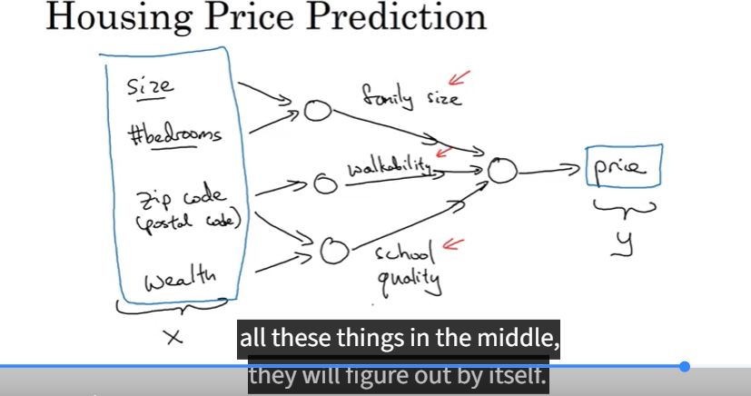
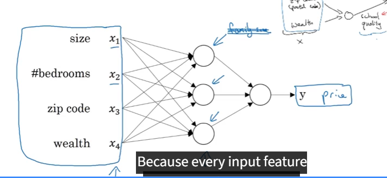

# DeepLearning-Andrew-Ng-Course-What-I-Learn

Neural Network Basic
- House Pricing Example
input x = House size => Neuron => Output(Price y)
Relu function for Linear (Max of 0)

# Neural Network
- Uses multiple Neurons
    -  for example with the house pricing multiple neurons with data like size, walkability
    - in this example 4 input x and the middle will be figured out by itself
    

the middle ones are called hidden layer

# Model Types
- for example with the house pricing it could use a standard NN (NeuralNetwork)
- CNN Convulutional NN ofent used for Image data
- RNN Recurrent Neural Network
- Custom / Hybrid

# Structured and Unstructured Data
- Structured like a Table with conenctions

Unstructured => for example audio files