# DeepLearning-Andrew-Ng-Course-What-I-Learn

# Goal --- Understand the Math behind ML and have reference to later check on if i work on projects

Neural Network Basic

- House Pricing Example
  input x = House size => Neuron => Output(Price y)
  Relu function for Linear (Max of 0)

# Neural Network

- Uses multiple Neurons
  - for example with the house pricing multiple neurons with data like size, walkability
  - in this example 4 input x and the middle will be figured out by itself
    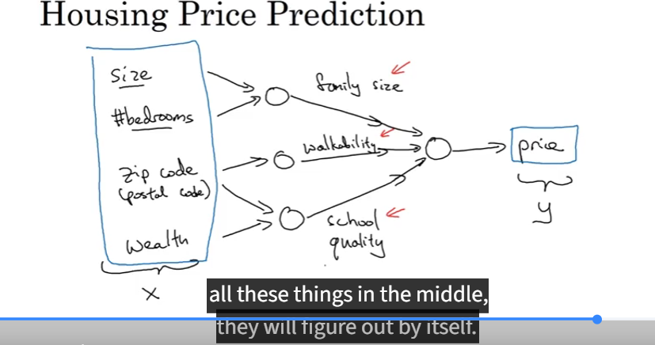

the middle ones are called hidden layer
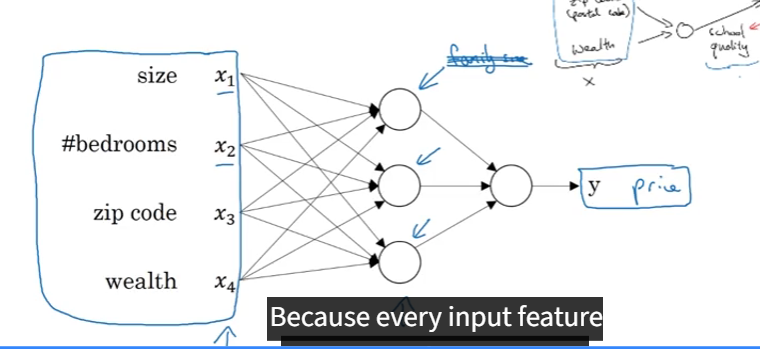

# Model Types

- for example with the house pricing it could use a standard NN (NeuralNetwork)
- CNN Convulutional NN ofent used for Image data
- RNN Recurrent Neural Network
- Custom / Hybrid

# Structured and Unstructured Data

- Structured like a Table with conenctions

Unstructured => for example audio files or images, piece of Text

# Learning progress

- what is effecting the Progress -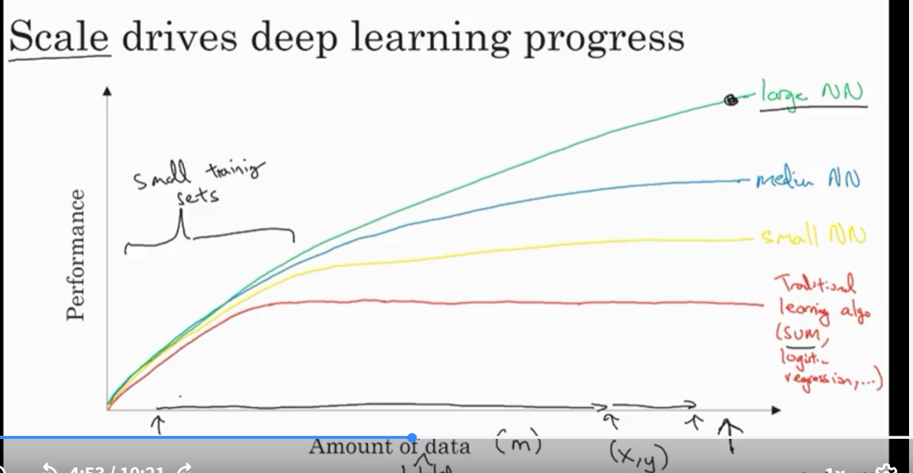
- scaled data
- the switch from sigmoid funtion to railer funciton
  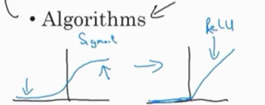
- so algorithms cane change the speed of the code and computation so it will can run much faster

# Graded Test to check if i understood those things

ChecK

# Binary classification

# Logistic Regresssion

- for example 1(cat) vs 0 (no Cat) so binary
- Image example what happens under the hood
  -putting for an image all colors so red blue green into a vector then if we have an image for 64x64 pixels it would look like this
  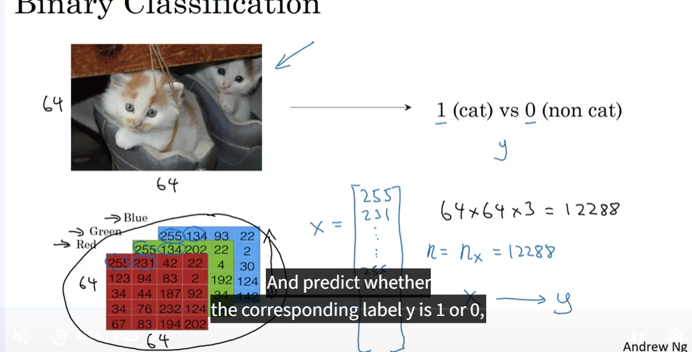
  maths = (x,y)
  where x is an x dimensional feature vector
  and y the label is either 0 or 1
  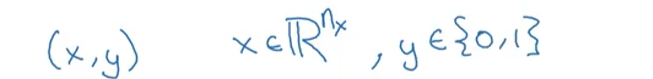
  training examples = (x(1),y(1)),(x(2),y(2)),(x(m),y(m))
  where xm is the last training example
  M = Mtrain

M test(subscript) = number of test examples

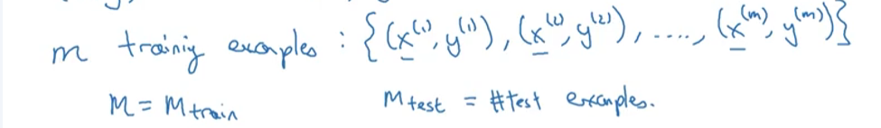

Put those x(1) ,x(2) into a Matrix
So Matrix X where M is the number of training examples and the height of this Matrix is NX or called railroads

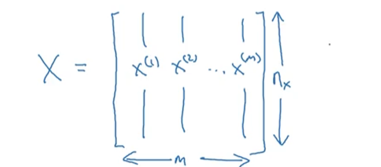

# x.shape

. python command for finding the shape of the matrix

# y.shape

# Logistic regression

- Given x , want Y^=P(y=1/x)
- X is an X dimensional vector
  Parameters : W also and X dimensional vector
  and b which is just a real number
  Output Y^ =

# sigmoiod function

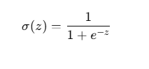!

Case 1-----> if z is large == then e to the nefative z will be close to 0
that also means if z is very large then sigmoid of z is very close to 1
Case 2-----> if z is very small or a verz large negative number
then sigmoid of z comes very close to zero

- in python s = 1 / (1 +math.exp(-x)) but thats bat practice using math function
- better to use s = 1/(1+ np.exp(-x))

# what that all means

- we want to predict something that has only 2 outcomes (0 or 1)
- to make these prediction using two things the parameters (W,B)
- W → weights (how important each feature is)
- B → bias (a number to adjust the prediction)
  ====> so the goal is We want our model to correctly predict the probability that the answer is 1 (true).
  and this is done by tuning W and B

  # Loss(error) function

  - The loss is used to evaluate the performance of your model. The bigger your loss is, the more different your predictions ( 𝑦̂
    ) are from the true values ( 𝑦
    ). In deep learning, you use optimization algorithms like Gradient Descent to train your model and to minimize the cost.

  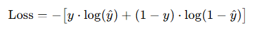

  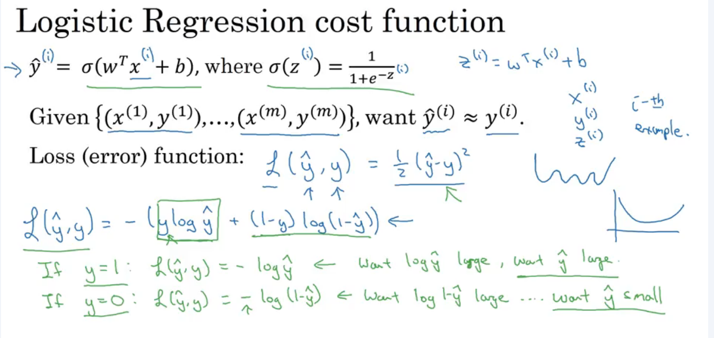

- so if y= 1 we want y hat to be large and if y=0 we want y hat to be small and the y hat is the formual y^​=σ(wTx+b) so we change the parameters to archiev this (parameter = w and b)

  # Cost function

J(w,b) = 1/m
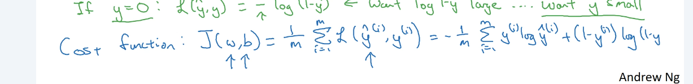

# Rules

- the Loss function will be used on a single training example
  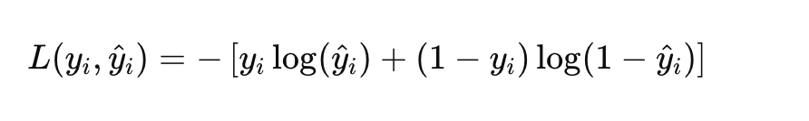
- the cost function will be applied to the entire training set
  J(w,b) = 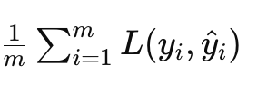

# Math extra

- how does a convex function look
  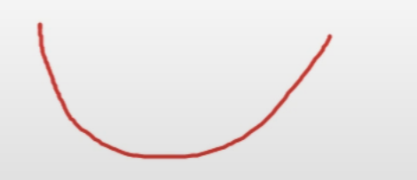

- how does a non convex function look

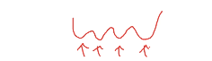

# Gradient Decent

- initalizing w and b
- it will goe downhill in the direction of steepest decent from the initalizet value

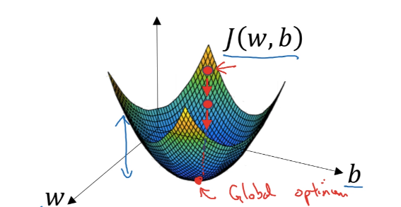

- w = w- alpha(thats the learning rate it will control how big the steps are on eacdh iteration of gradient decent) dJ(w) / dw
- this will be repeated und the algorithm converged or in other word if the algo stops if it doesnt change much anymore
- this is with only b as a parameter but J(w,b) has two then it would look like this
- w:= w-alpha dJ(w,b)/dw
- b:= b-alpha dJ(w,b)/db

# Calculus Tips

- partial derivative symbol will be used instead of lower case d if the function J has 2 or more parameters
  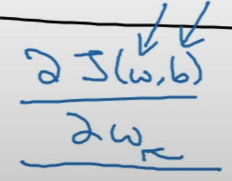

- The derivative is the slope — it shows how much
  𝑓(𝑥) changes when x changes a little.
  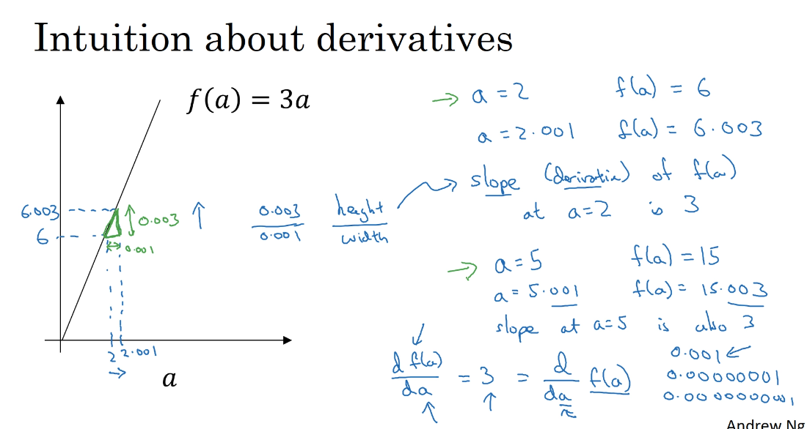

- rule for
  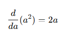
- If a goes up a little, a² goes up about 2a times as much
  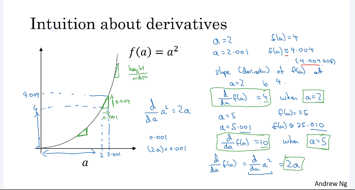
- examples
  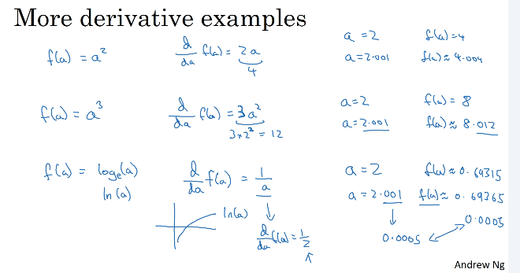

-chain rule
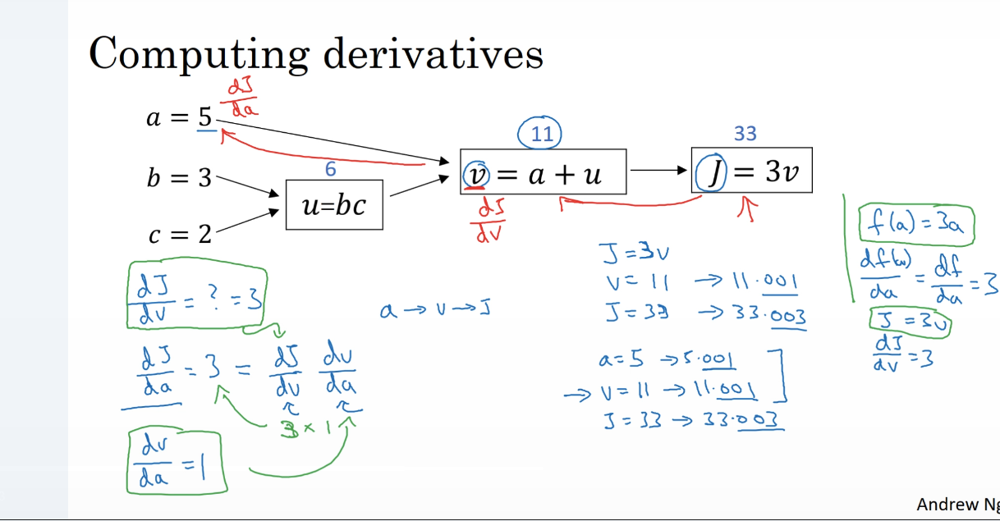

- here was dj/dv =3 and dv/da = 1 so dj/da = 3

- backpropagation
  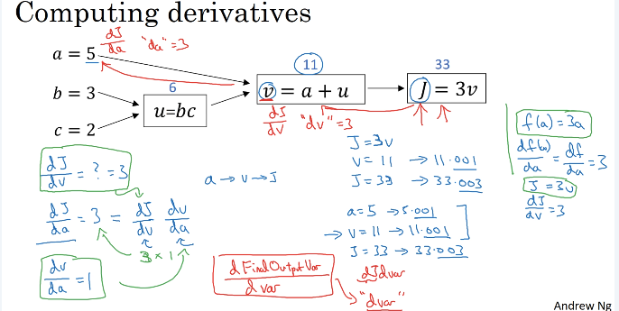
- what has been done here ===> go backward and figured out that dv = 3 (dj/dw)
  da = 3 dj/da
  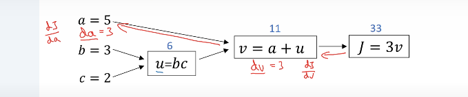
- another example here if we want to find out dj/db
  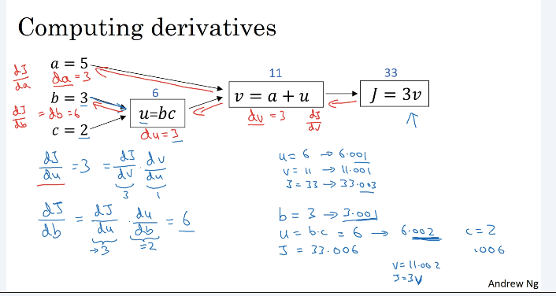

# Gradient Descent in Logitic Regression

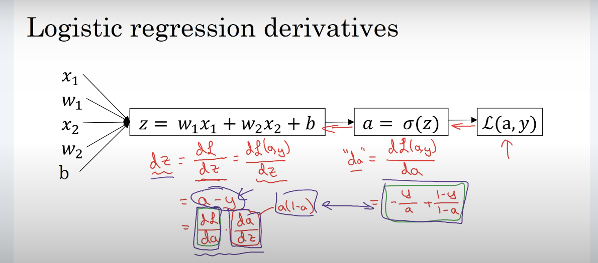

- goal here is to check how L changes it we switch up w1, w2, or b by a bit
- the chain rule dl/dz = dl/da \* da/dz

- last step in this example is to check how much we need to change w and b
  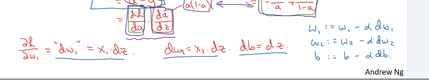

# Implement Logistic Regression

- using a For Loop
- This example only has 2 features, but with a larger training set or more features, using Python loops would become much slower, while vectorized operations would still scale efficiently.
- cause the training data becomes bigger and bigger so in deep learning it became really important to get rid of the for loops and use vectorization
  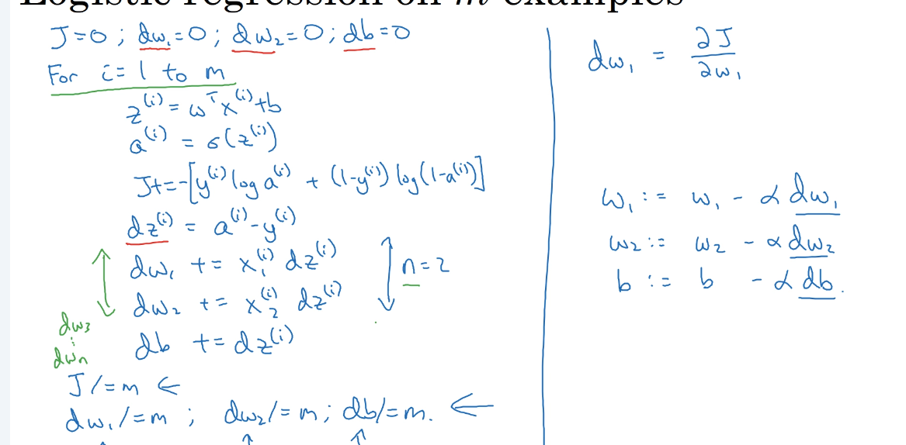

# Deeper explanation of the Derivation of dl/dz

- https://community.deeplearning.ai/t/derivation-of-dl-dz/165?_gl=1*15es6ec*_ga*MjA4MjY4MzY1NS4xNzYwOTAzOTU1*_ga_FR2MZ1VLMS*czE3NjIwMDEwODAkbzQkZzEkdDE3NjIwMDIzODgkajYwJGwwJGgw

# Neural Network programming guideline

- Whenever possible avoid explicit for loop

# Vectorization

- just an example how much faster the code runs in python with Vectorization
- np.dot()
  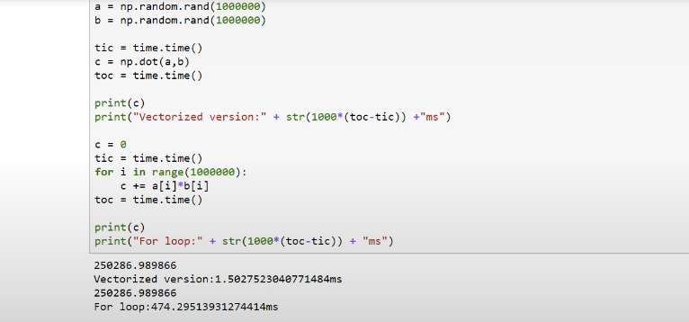

- here how it would look in python with foor loop and with build in function from numpy vectorization
- goal is to use an inbuild function whenever its possible
  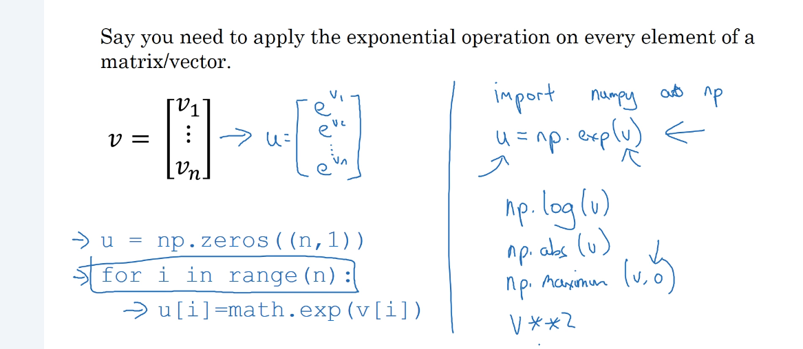

- in the example from before we now remove one for loop and use a vector instead of the 2 initialized values dw1 and dw2
  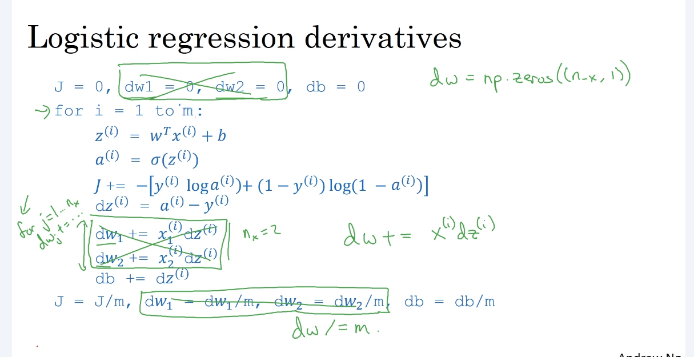

# Vecrotizing Logistic Regression

- this example is for the Z
- the simplified numpy command for this example is
- Z = np.dot(w\*T,x) + b
- this is called Broadcasting in python
  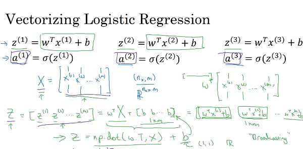

- now the same for the a values
- A = [a(1) a(2).... a(m)] = Sigmoid(Z)
- sigmpid inputs the Z as a varaible

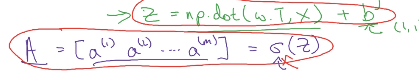

- here with just one line of code for each we can compute dz ,db and dw

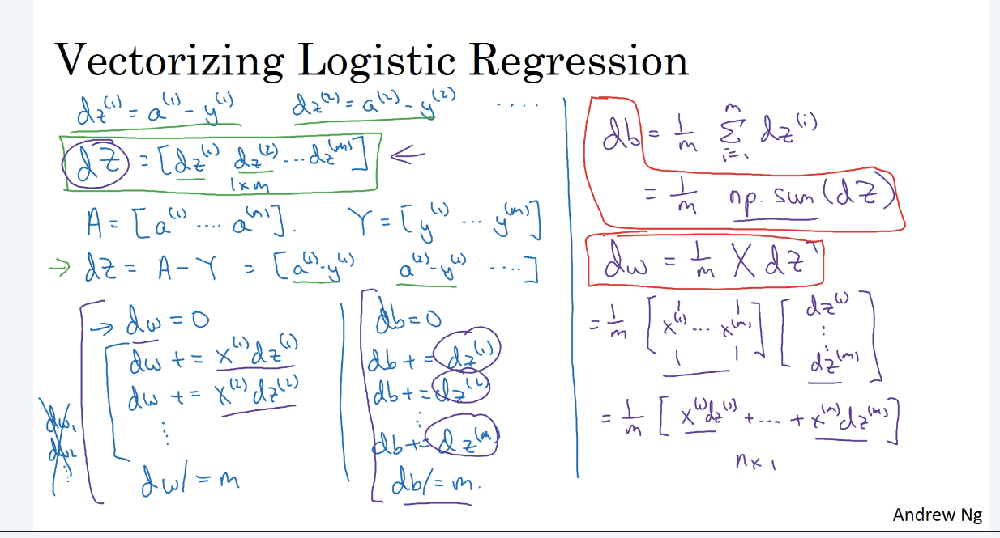

- now compared with the for loop approach
  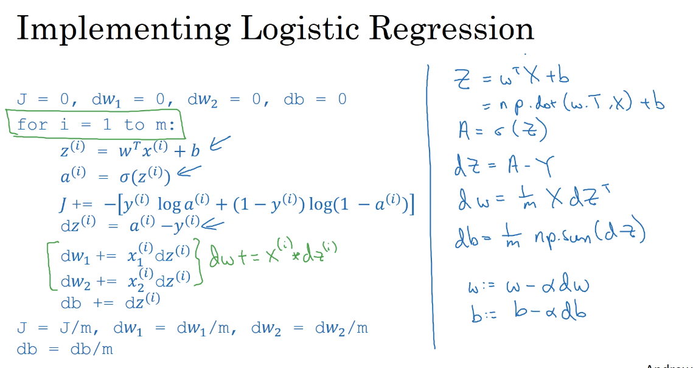

# Broadcasting in python

- so python will fill out
  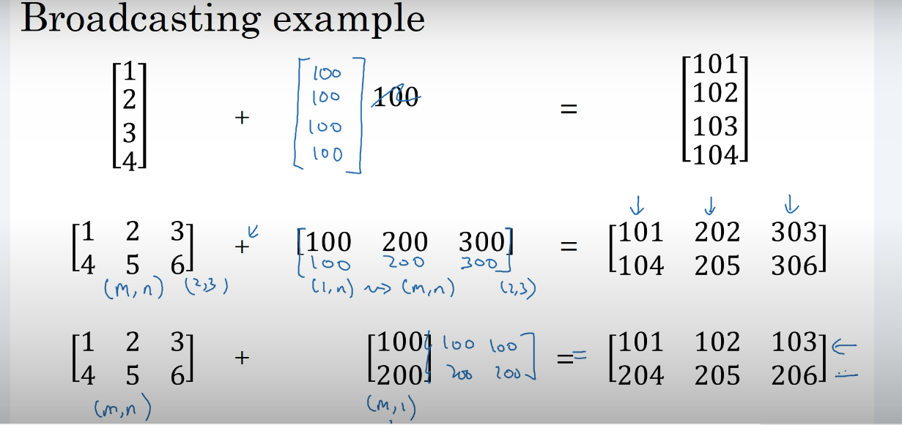

# Logistic Regression Cost Function

- by misimize the Cost function J(w,b)
- MLE Maximum Likelihood Estimation

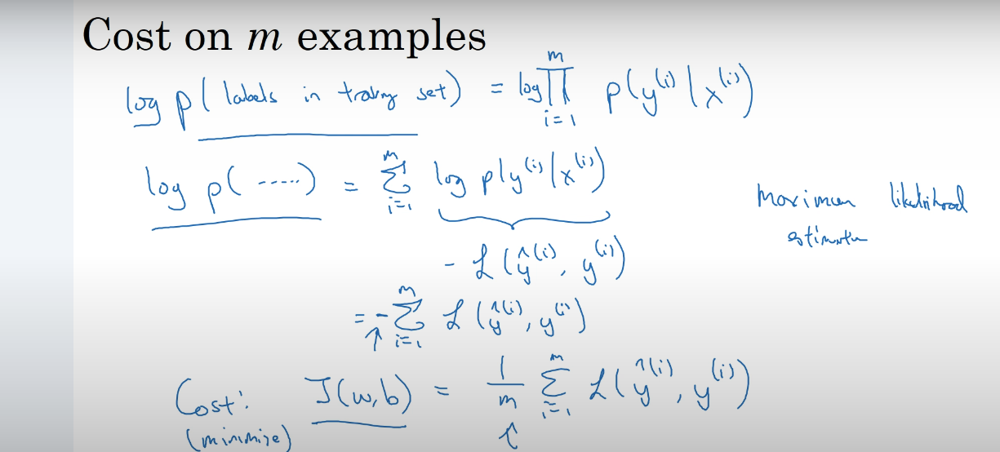

# Hints for me how to reshape image data

- in ML each column should represent one training example this is why we here use Transpose

- next step would be to standardize
  train_set_x = train_set_x_flatten / 255
  test_set_x = test_set_x_flatten / 255

**What you need to remember:**

Common steps for pre-processing a new dataset are:

- Figure out the dimensions and shapes of the problem (m_train, m_test, num_px, ...)
- Reshape the datasets such that each example is now a vector of size (num_px \* num_px \* 3, 1)
- "Standardize" the data

# Initalizing methods

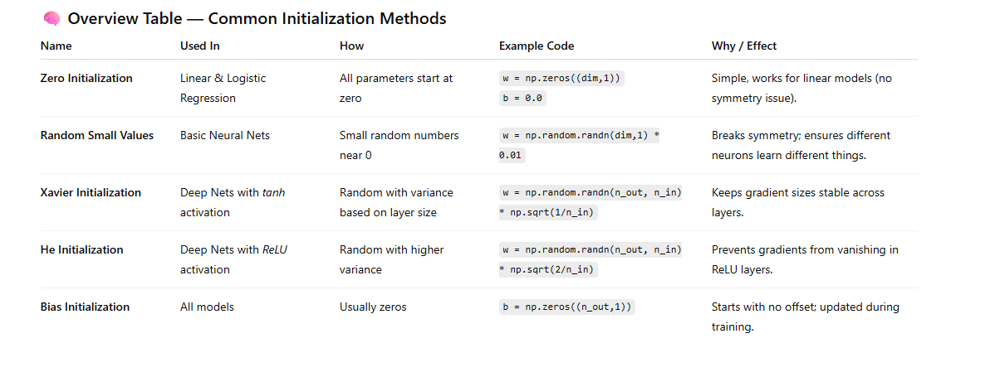

# Neural Network

- we have 2 layers here in this example and also do the back propagation
  DeepLearning-Andrew-Ng-Course-What-I-Learn
  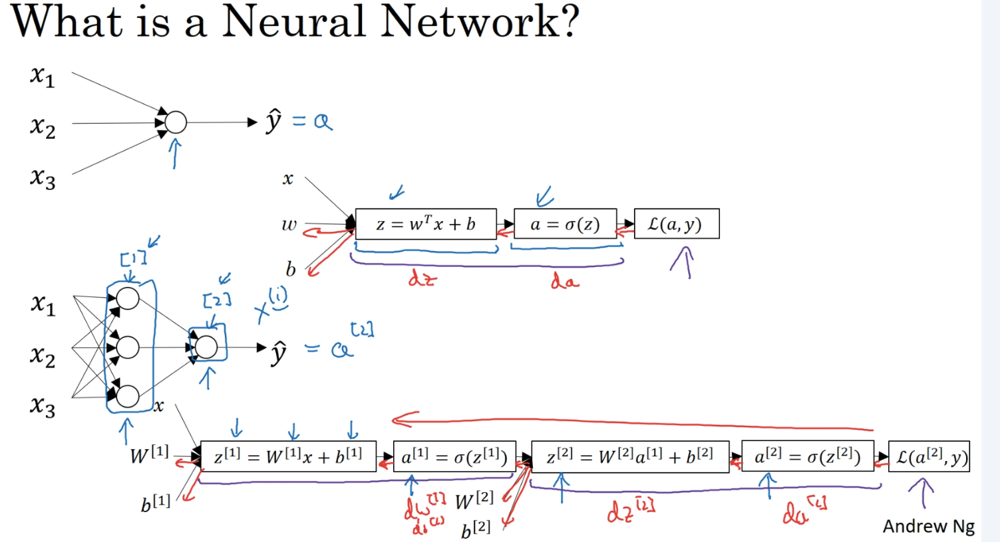

# Layers of a Neural Network

- Input layer a[0] = x also called layer zero 0
- Hidden Layer a[1] a 4d vector in this example also called layer 1
  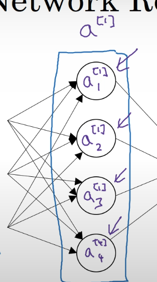 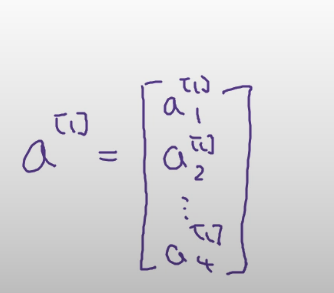
  the hidden layer parameter are w[1],b[1] where w(4,3) means 4 nodes in the hidden layer and 3 in the input layer for b(4,1)
- Output Layer Yhat = a[2] also called layer 2 this output layer also have those parameter w[2] (1,4) again here hidden layer has 4 units and the output layer has just one unit,b[2]
