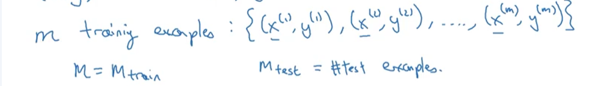

# DeepLearning-Andrew-Ng-Course-What-I-Learn

Neural Network Basic
- House Pricing Example
input x = House size => Neuron => Output(Price y)
Relu function for Linear (Max of 0)

# Neural Network
- Uses multiple Neurons
    -  for example with the house pricing multiple neurons with data like size, walkability
    - in this example 4 input x and the middle will be figured out by itself
    

the middle ones are called hidden layer

# Model Types
- for example with the house pricing it could use a standard NN (NeuralNetwork)
- CNN Convulutional NN ofent used for Image data
- RNN Recurrent Neural Network
- Custom / Hybrid

# Structured and Unstructured Data
- Structured like a Table with conenctions

Unstructured => for example audio files or images, piece of Text

# Learning progress
- what is effecting the Progress
-
- scaled data
- the switch from sigmoid funtion to railer funciton

- so algorithms cane change the speed of the code and computation so it will can run much faster 
# Graded Test to check if i understood those things
ChecK
# Binary classification
# Logistic Regresssion
-   for example  1(cat) vs 0 (no Cat) so binary
- Image example what happens under the hood
    -putting for an image all colors so red blue green into a vector then if we have an image for 64x64 pixels it would look like this
    
maths = (x,y) 
where x is an x dimensional feature vector
and y the label is either 0 or 1 

training examples = (x(1),y(1)),(x(2),y(2)),(x(m),y(m))
where xm is the last training example
M = Mtrain

M test(subscript) = number of test examples

Put those x(1) ,x(2) into a Matrix
So Matrix X where M is the number of training examples and the height of this Matrix is NX or called railroads

